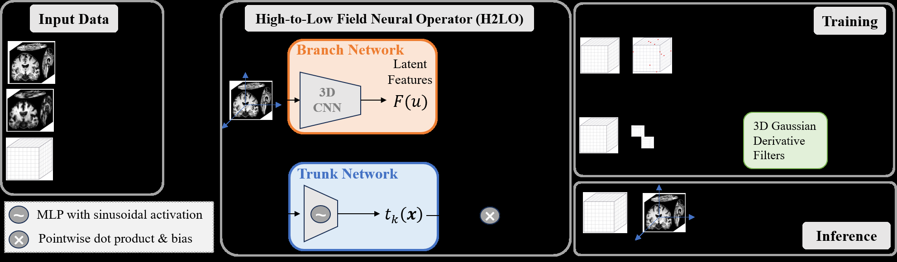

# H2LO — Subject-Specific Low-Field MRI Synthesis via a Neural Operator

Official implementation of **H2LO** (MICCAI 2026).

> **This is v1: the MICCAI 2026 implementation.** It reproduces the method and results of the
> conference paper. An extended version of H2LO is in preparation. Stay tuned for more!

## Updates

- **2026-10** · v1 released: the MICCAI 2026 implementation (training, evaluation, paper configuration).
- **2026-10** · v1.1: pretrained fold-0 weights (T1w, T2w) and their expected results.
- *Coming soon* · the extended H2LO. Stay tuned!

> **Subject-Specific Low-Field MRI Synthesis via a Neural Operator**
> Ziqi Gao, Nicha C. Dvornek, Xiaoran Zhang, Gigi Galiana, Hemant D. Tagare, R. Todd Constable
> MICCAI 2026. [arXiv:2603.24968](https://arxiv.org/abs/2603.24968)



H2LO synthesizes a low-field (LF, 64 mT) MRI volume from a high-field (HF, 3 T) volume of the
same subject by learning the HF→LF mapping as an operator between function spaces (DeepONet).
A **branch** network (a lightweight 3D CNN) encodes the HF volume into a dense feature field whose
values at a query coordinate `x` give coefficients `b_k(u, x)`; a **trunk** network (SIREN) maps
`x` to basis functions `t_k(x)`; the LF intensity is their dot product plus a bias,

```
G(u)(x) = Σ_k b_k(u, x) · t_k(x) + β .
```

Training minimizes an L1 loss on randomly sampled voxels plus a 3D Gaussian-derivative gradient
loss on a random sub-volume: `L = L1 + λ_grad · L_grad`.

## Repository

```
h2lo/model.py     H2LO operator (branch encoder, SIREN / MLP trunk), full-volume inference
h2lo/losses.py    3D Gaussian gradient loss
h2lo/data.py      ds006557 paired volumes and the 5-fold subject splits
h2lo/metrics.py   the eight evaluation metrics
h2lo/train.py     training
evaluate.py       test-set evaluation (per subject, per fold, mean ± std over folds)
```

## Installation

```bash
pip install -r requirements.txt
```

A CUDA GPU is recommended (training and inference use mixed precision).

## Data

The paired HF/LF data are OpenNeuro [ds006557](https://openneuro.org/datasets/ds006557)
(23 subjects scanned at 3 T and 64 mT; T1w and T2w). We use the 3 T session `ses-GE` and the
64 mT session `ses-HFC` as provided in the dataset's `derivatives/ants-mrr` (already resampled to the
3 T grid), and skull-strip every volume with
[SynthStrip](https://surfer.nmr.mgh.harvard.edu/docs/synthstrip/):

```bash
DS=/path/to/ds006557; OUT=/path/to/prepared
for i in $(seq -w 0 22); do s=sub-HYPE$i
  # T1w (sub-HYPE06 has no 64 mT T1w)
  [ $s != sub-HYPE06 ] && mkdir -p $OUT/ds006557_HFC_T1/$s && \
    mri_synthstrip -i $DS/$s/ses-GE/anat/${s}_ses-GE_acq-MPRAGE_T1w.nii.gz -o $OUT/ds006557_HFC_T1/$s/HF_synthstrip.nii.gz && \
    mri_synthstrip -i $DS/derivatives/ants-mrr/$s/ses-HFC/${s}_ses-HFC_T1w_mrr.nii.gz -o $OUT/ds006557_HFC_T1/$s/LF_synthstrip.nii.gz
  # T2w
  mkdir -p $OUT/ds006557_HFC_T2/$s
  mri_synthstrip -i $DS/$s/ses-GE/anat/${s}_ses-GE_T2w.nii.gz -o $OUT/ds006557_HFC_T2/$s/HF_synthstrip.nii.gz
  mri_synthstrip -i $DS/derivatives/ants-mrr/$s/ses-HFC/${s}_ses-HFC_T2w_mrr.nii.gz -o $OUT/ds006557_HFC_T2/$s/LF_synthstrip.nii.gz
done
```

Each volume is max-normalized to [0, 1] when loaded. The 5-fold subject splits
(2 validation and 7 test subjects per fold) are defined in `h2lo/data.py`.

## Training

Paper configuration (the defaults): P = 128 basis functions, SIREN trunk with depth 4,
width 256 and ω₀ = 30; λ_grad = 10, Gaussian σ = 1, kernel 5, 32³ sub-volume; K = 8000 voxels per
step; Adam, learning rate 1e-4 with cosine annealing, 500 epochs; the checkpoint with the best
validation PSNR is kept.

```bash
python -m h2lo.train --data_root /path/to/prepared --contrast T1w --fold 0 --save_dir runs/T1w_fold0
```

Repeat for `--contrast {T1w,T2w}` and `--fold {0..4}`. Ablations: `--trunk_type mlp` (w/o SIREN),
`--lambda_grad 0` (w/o gradient loss).

## Evaluation

```bash
python evaluate.py --data_root /path/to/prepared --contrast T1w --folds 0 1 2 3 4 \
    --ckpt "runs/{contrast}_fold{fold}/best_model.pth" --out results_T1w.csv
```

Metrics are computed on the whole volume in [0, 1]: PSNR, SSIM (mean over slices), NCC, and the
histogram metrics Wasserstein-1, NMI, histogram NCC, Bhattacharyya distance and Jensen–Shannon
divergence. Each fold is averaged over its test subjects; the table reports mean ± std over folds.

Expected results (5-fold test, mean ± std over folds):

| Contrast | PSNR (dB) | SSIM | NCC | Wasserstein | NMI | Hist. NCC | Bhattacharyya | JS |
| --- | --- | --- | --- | --- | --- | --- | --- | --- |
| T1w | 28.98 ± 0.27 | 0.948 ± 0.002 | 0.975 ± 0.002 | 0.057 ± 0.025 | 0.472 ± 0.023 | 1.000 ± 0.000 | 0.026 ± 0.014 | 0.023 ± 0.013 |
| T2w | 28.37 ± 0.38 | 0.943 ± 0.005 | 0.926 ± 0.006 | 0.051 ± 0.043 | 0.432 ± 0.062 | 0.994 ± 0.009 | 0.061 ± 0.067 | 0.054 ± 0.058 |

## Pretrained weights

Checkpoints for fold 0 of both contrasts are included in `weights/` (model weights only, 0.58 M parameters):

| File | Contrast | Fold | Epoch |
| --- | --- | --- | --- |
| `weights/h2lo_T1w_fold0.pth` | T1w | 0 | 340 |
| `weights/h2lo_T2w_fold0.pth` | T2w | 0 | 420 |

Evaluate them on the fold-0 test split:

```bash
python evaluate.py --data_root /path/to/prepared --contrast T1w --folds 0 \
    --ckpt "weights/h2lo_{contrast}_fold{fold}.pth" --out results_T1w_fold0.csv
```

Expected results with these weights (fold-0 test split, 7 subjects each; the table above is the 5-fold mean):

| Contrast | PSNR (dB) | SSIM | NCC | Wasserstein | NMI | Hist. NCC | Bhattacharyya | JS |
| --- | --- | --- | --- | --- | --- | --- | --- | --- |
| T1w | 28.96 | 0.946 | 0.974 | 0.083 | 0.443 | 1.000 | 0.039 | 0.036 |
| T2w | 28.24 | 0.944 | 0.925 | 0.031 | 0.462 | 1.000 | 0.019 | 0.018 |

## Contact

Questions and issues: open a GitHub issue or contact Ziqi Gao (ziqi.gao@yale.edu).

## Acknowledgements

The code structure started from [ArSSR](https://github.com/iwuqing/ArSSR) (Wu et al., IEEE JBHI 2023);
the SIREN layers follow [Sitzmann et al. (NeurIPS 2020)](https://github.com/vsitzmann/siren).

## Citation

```bibtex
@inproceedings{gao2026h2lo,
  title     = {Subject-Specific Low-Field MRI Synthesis via a Neural Operator},
  author    = {Gao, Ziqi and Dvornek, Nicha C. and Zhang, Xiaoran and Galiana, Gigi and Tagare, Hemant D. and Constable, R. Todd},
  booktitle = {Medical Image Computing and Computer Assisted Intervention (MICCAI)},
  year      = {2026}
}
```
